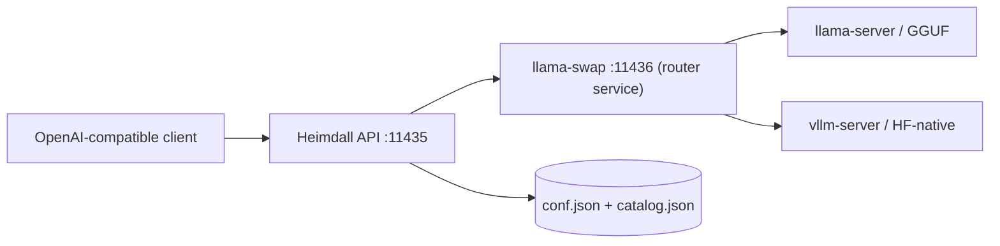

# Heimdall Gateway

Heimdall Gateway is a local, OpenAI-compatible inference gateway for running
and switching large language models on your own hardware. It manages model
artifacts, generates the runtime configuration, and routes requests through
`llama-swap` to `llama.cpp` or the vLLM beta backend, exposing diagnostics
for operators.

It is designed for machines with one or more NVIDIA GPUs, but the gateway
itself is ordinary Python and can also be used to manage a CPU-backed
installation.

## What it does

- Downloads and registers Hugging Face GGUF models.
- Selects the right GGUF file from quantized and sharded repositories.
- Builds the `llama-swap` configuration from a catalog instead of requiring
  hand-written service definitions.
- Routes OpenAI-compatible requests to `llama.cpp` or vLLM.
- Supports automatic context selection, MTP/speculative configurations,
  family defaults, GPU placement, and optional conversation-affine replicas.
- Preserves an existing user or system installation during updates, including
  its model directory, TLS material, API settings, and service ports.
- Provides request logs, service diagnostics, configuration validation, and
  safe orphan-model cleanup.

The public command is **`heimdall-gateway`**. There is no legacy public CLI
alias.

## Architecture



The API service (`heimdall-gateway-manager`) and the router service
(`heimdall-gateway-router`, which runs `llama-swap`) are separate from the
model processes. Every model process is spawned by `llama-swap` on demand:
GGUF models run on `llama-server`, while native Hugging Face repositories run
on the vLLM beta backend. An idle installation does not have to keep every
model in VRAM.

## Requirements

- Linux.
- Python 3.12 or newer for the gateway CLI.
- NVIDIA driver/CUDA when using GPU inference.
- Enough disk space for the models and temporary downloads.
- A working `llama-server`/`llama-swap` installation for the llama.cpp path.
  The installer can download or build these components.

## Install

### New user installation

```console
$ python3.12 -m pip install .
$ heimdall-gateway install --mode user --backend auto
```

The installer creates the user services and stores state below
`~/.local/state/heimdall-gateway`. For a development checkout, use an
editable install:

```console
$ python3.12 -m venv .venv
$ . .venv/bin/activate
$ python -m pip install -e .
$ heimdall-gateway install --mode user --backend auto
```

For a checkout without a prior `pip install`, the bundled wrapper is equivalent
(it creates a bootstrap venv automatically):

```console
$ ./llamacpp_stack/bundle/install_llamacpp_stack.sh --mode user --backend auto
```

### New system installation

```console
$ python3.12 -m pip install .
$ sudo heimdall-gateway install --mode system --backend auto
```

System installations use `/etc/heimdall-gateway` for configuration and
`/var/lib/heimdall-gateway` for runtime state. The installer may ask for
backend, network, TLS, and model-directory settings on the first install.

### Update an existing installation

Run the same installer command with the existing mode. Updates are intended
to be non-destructive: they reuse the configured model directory and do not
regenerate certificates unless explicitly requested.

```console
# User installation
$ heimdall-gateway install --mode user --backend auto

# System installation
$ sudo heimdall-gateway install --mode system --backend auto
```

Use `--regenerate-api-cert` only when a new API certificate is really needed.
Use `--dry-run` to inspect an installation plan without changing the machine:

```console
$ heimdall-gateway install --mode user --backend auto --dry-run
```

For all installer options:

```console
$ heimdall-gateway install --help
```

## First checks

After installation, restart the services and inspect the effective runtime:

```console
$ systemctl --user restart heimdall-gateway-manager heimdall-gateway-router
$ heimdall-gateway info
```

Typical output looks like this; paths and versions depend on the installation:

```text
========================================================================
                         Heimdall Gateway
Default endpoints:
  llama-swap UI/backend: http://127.0.0.1:11436
  Heimdall Gateway API: http://127.0.0.1:11435
Installed versions:
  llama.cpp:           b10156
  llama-swap:          v244
Service management:
  Install mode:        user
  Idle TTL:            300s
  API status:          reachable
  UI status:           reachable
```

For a system installation, use `sudo systemctl restart
heimdall-gateway-manager heimdall-gateway-router` and the corresponding
`sudo systemctl status` commands.

## Download and run a model

`add` registers a model without necessarily opening a chat. `run` downloads
the model if needed, updates the catalog, waits for the supervisor, and warms
the selected model.

```console
# GGUF repository with a quantization selector
$ heimdall-gateway add -hf Qwen/Qwen2.5-32B-Instruct-GGUF:Q4_K_M

# Download, configure, load, and warm it
$ heimdall-gateway run -hf Qwen/Qwen2.5-32B-Instruct-GGUF:Q4_K_M --auto

# Update the configuration for a catalog model
$ heimdall-gateway update qwen2.5-32b-instruct-q4_k_m --auto

# Validate a model without starting a chat
$ heimdall-gateway validate -hf Qwen/Qwen2.5-32B-Instruct-GGUF:Q4_K_M --auto
```

For speculative/MTP models, the base and draft model can be supplied together:

```console
$ heimdall-gateway run \
    -hf org/base-model:Q4_K_M \
    --speculative \
    -hf org/draft-model:IQ1_M
```

When the repository metadata and files identify a supported MTP layout,
Heimdall derives the draft configuration. Always inspect `info`, `list`, and
the generated command when validating a new model family.

## OpenAI-compatible API

The default API is available at `http://127.0.0.1:11435`. If API HTTPS or
authentication is enabled, use the configured scheme and API key instead.

```console
# List the public models
$ curl -s http://127.0.0.1:11435/v1/models | jq

# Check replica/router diagnostics
$ curl -s http://127.0.0.1:11435/api/replicas | jq

# Send a chat completion
$ curl -s http://127.0.0.1:11435/v1/chat/completions \
    -H 'Content-Type: application/json' \
    -d '{
      "model": "qwen2.5-32b-instruct-q4_k_m",
      "messages": [{"role": "user", "content": "Give me a one-line hello."}],
      "stream": false
    }' | jq
```

The gateway also translates the modern Responses request shape at
`/v1/responses` and supports the legacy completions path where the selected
backend supports it. The public model ID remains the base model ID even when
an internal replica handles the request.

### Context metadata

`GET /v1/models` publishes context metadata for clients that use it to size a
conversation. Depending on the client, the relevant fields are exposed as
`context_length`, `context_window`, `max_context_length`, `max_model_len`,
`max_input_tokens`, and `max_output_tokens`.

```console
$ curl -s http://127.0.0.1:11435/v1/models \
    | jq '.data[] | {id, context_length, context_window, max_context_length}'
```

Clients that cache model metadata may need to refresh or switch the model
again after a context configuration update.

## Configuration model

There are two sources of configuration, with a generated runtime file between
them:

| Purpose | User mode | System mode |
|---|---|---|
| Global settings | `~/.config/heimdall-gateway/conf.json` | `/etc/heimdall-gateway/conf.json` |
| Model catalog | `~/.local/state/heimdall-gateway/catalog.json` | `/var/lib/heimdall-gateway/catalog.json` |
| Generated llama-swap config | `~/.local/state/heimdall-gateway/config.yaml` | `/var/lib/heimdall-gateway/config.yaml` |
| Templates | `~/.config/heimdall-gateway/templates` | `/etc/heimdall-gateway/templates` |
| Request log | `~/.local/state/heimdall-gateway/api-requests.log` | `/var/lib/heimdall-gateway/api-requests.log` |

`conf.json` contains global service settings and llama-server defaults.
`catalog.json` contains the model inventory and per-model overrides.
`config.yaml` is generated for the supervisor and should not be treated as a
second hand-maintained catalog. After changing the catalog or global defaults:

```console
$ heimdall-gateway config-migrate
$ heimdall-gateway update
$ systemctl --user restart heimdall-gateway-manager heimdall-gateway-router
```

`info` prints the effective paths and reachability. A service restart also
reports the configuration it is using and warns about invalid values.

Inspect supported keys and their locations with:

```console
$ heimdall-gateway config-keys
$ heimdall-gateway config-keys --format json
```

### Global llama-server defaults

The bundled defaults include sampling, KV-cache, batching, GPU, and context
settings. The effective installation may extend or override them. A typical
fragment is:

```json
{
  "llama_server_defaults": {
    "cache_type_k": "f16",
    "cache_type_v": "f16",
    "top_k": 20,
    "top_p": 0.95,
    "min_p": 0.0,
    "repeat_penalty": 1.0,
    "presence_penalty": 0.0,
    "batch_size": 4096,
    "ubatch_size": 2048,
    "n_gpu_layers": -1,
    "parallel": 1
  }
}
```

Use `llama_server_family_defaults` for model-family defaults, matched by model
name. For example, a Qwen family can enable reasoning defaults without
copying them into every model entry:

```json
{
  "llama_server_family_defaults": {
    "qwen": {
      "predict": 16384,
      "reasoning": "on",
      "reasoning_budget_message": "Okay, I have thought enough. I will now provide the final answer",
      "chat_template_kwargs": {"preserve_thinking": false}
    }
  },
  "llama_server_defaults": {
    "reasoning_budget": "half_context"
  }
}
```

`reasoning_budget: "half_context"` is the safe default for reasoning models.
Heimdall sends half of the model's configured context as a request-level
`thinking_budget_tokens` value, then clamps it to the active `max_tokens` (or
`predict`) while reserving room for visible output. Tiny one-message capability
probes are sent with a zero thinking budget so they cannot consume their whole
response on hidden reasoning. A numeric per-model or per-family value remains
an explicit override. This is deliberately not the same as disabling
reasoning globally: reasoning remains available for planning and tool calls.
To disable it for a family or model, set `reasoning: "off"` in that family's
defaults or in `server_overrides`; the request-level budget is then omitted.

Raw per-model llama.cpp flags belong in the model's `server_overrides`:

```json
{
  "server_overrides": {
    "parallel": 1,
    "tensor_split": "1,1",
    "cache_prompt": true
  }
}
```

Values are converted to command-line flags: scalar values become
`--flag value`, booleans become the corresponding enabled/disabled option,
and a null value represents a valueless flag. The installed llama-server
still decides whether a flag is valid; use `config-keys` and the diagnostic
commands to catch unsupported options before loading a model.

### Conversation replicas

Replicas are disabled by default and are controlled globally. They are
internal runtime entries; clients continue to use the public base model ID.
The default placement policy is exclusive GPU sets, which is the conservative
choice for large models:

```json
{
  "replicas": {
    "enabled": true,
    "max": "auto",
    "placement": "exclusive_gpus",
    "safety_vram_mib": 2048
  }
}
```

The router keeps conversation/session/agent affinity so a continuing
conversation stays on the same replica. It uses cached GPU telemetry and
in-flight request state to decide whether to reuse a ready replica or start a
new one. Inspect the live state with:

```console
$ curl -s http://127.0.0.1:11435/api/replicas | jq
```

### Tool-call repair (experimental)

Tool repair is off by default. If enabled, the gateway can retry a response
that contains tools but ends with a strong syntactic signal that no valid tool
call was emitted. The repair request uses the available tool definitions and
can be configured to keep its notice out of the visible transcript.

```json
{
  "experimental": {
    "chat_tool_continue_repair": {
      "enabled": true,
      "max_rounds": 4,
      "trigger_suffixes": [":"],
      "trigger_prefixes": ["Voy a", "[terminal command"],
      "visible_notice_after_seconds": 3,
      "loop_guard": {"enabled": true, "max_repeated_repairs": 1}
    }
  }
}
```

Keep repair limits small and monitor the request log. The gateway never
forwards incomplete tool-call JSON to the upstream tool executor.

## Replicas, loading, and observability

The first request that needs a cold model owns its load. Concurrent requests
for the same cold model are held/retried instead of launching competing loads.
A model process can use several GPUs; `nvidia-smi` therefore shows one PID on
each selected GPU for that process. Replica processes, when created, have
different PIDs and internal IDs.

Useful operator commands:

```console
$ heimdall-gateway list
$ heimdall-gateway ps
$ heimdall-gateway requests --lines 100
$ heimdall-gateway logs --lines 200 --journal
$ systemctl --user status heimdall-gateway-manager heimdall-gateway-router
```

For a system installation, prepend `sudo` to service and journal commands.
The request log is intended for diagnosis of upstream 4xx/5xx responses,
stream interruptions, model-load failures, and tool-call repair decisions.

## Cleanup and model lifecycle

Removing a catalog entry and removing its downloaded files are separate
operations. Before deleting artifacts, preview files that are not referenced
by the catalog:

```console
$ heimdall-gateway remove-orphans --dry-run
$ heimdall-gateway remove-orphans --yes
```

The cleanup command understands GGUF shard directories and stays below the
configured models directory. It asks for confirmation by default and only
falls back to elevated deletion when a real permission error requires it.

Other lifecycle commands:

```console
$ heimdall-gateway unload MODEL_ID
$ heimdall-gateway remove MODEL_ID
$ heimdall-gateway refresh-templates
$ heimdall-gateway remove-templates
```

## Troubleshooting

### API is unavailable or returns 502

Check the two Heimdall services, then inspect the supervisor and request log:

```console
$ heimdall-gateway info
$ systemctl --user status heimdall-gateway-manager heimdall-gateway-router
$ heimdall-gateway logs --lines 200 --journal
$ heimdall-gateway requests --lines 200
```

An upstream 502 usually means that the selected model process exited during
load or became unavailable. The journal contains the original llama-server
command and stderr; do not diagnose this only from the client-side retry.

### A changed setting is not visible

Confirm that the edited file matches the mode shown by `info`. Then migrate,
regenerate, and restart:

```console
$ heimdall-gateway config-migrate
$ heimdall-gateway update
$ heimdall-gateway info
```

Do not edit the generated `config.yaml` as the long-term fix: the next update
will regenerate it from `conf.json` and `catalog.json`.

### The model uses the wrong GPU set

Inspect the effective model command with `ps`/`logs` and compare its
`CUDA_VISIBLE_DEVICES`, `--device`, and `--tensor-split` values. Make the
placement change in the model override, regenerate the config, and restart
the services. A single llama-server PID appearing on multiple GPUs is normal
when tensor parallelism is configured.

### Context shown by a client is too small

First inspect the gateway metadata:

```console
$ curl -s http://127.0.0.1:11435/v1/models \
    | jq '.data[] | select(.id == "MODEL_ID")'
```

If the API has the correct value but a client shows an old value, refresh the
client's model metadata/cache. If the API is wrong, run `update`, inspect the
generated config, and check the model's metadata/auto-context result in the
request log.

## Development

Install the package in editable mode and run the test suite:

```console
$ python3.12 -m venv .venv
$ . .venv/bin/activate
$ python -m pip install -e .
$ pytest -q
```

The tests cover configuration migration, model discovery, command rendering,
API compatibility, replicas, tool-call repair, installer behavior, and safe
cleanup. Tests that would require real GPUs or external model downloads use
fixtures/mocks; validate hardware-specific changes on a real installation as
well.

Useful local commands:

```console
$ heimdall-gateway --help
$ heimdall-gateway info
$ heimdall-gateway config-keys --format json
$ heimdall-gateway hacks
```

## Related documentation

- [`docs/LOCAL_OLLAMA_SETUP.md`](docs/LOCAL_OLLAMA_SETUP.md) — local Ollama
  compatibility setup.
- [`docs/VLLM-BETA.md`](docs/VLLM-BETA.md) — vLLM beta backend notes.
- [`docs/arg-hyphen-conventions.md`](docs/arg-hyphen-conventions.md) —
  configuration key and CLI flag conventions.
- [`docs/flags_llamacpp`](docs/flags_llamacpp) — llama.cpp flag reference.
- [`docs/lllamacpp_flags_API.md`](docs/lllamacpp_flags_API.md) — API-facing
  flag reference.

## Security notes

- Do not commit API keys, private keys, certificates, request logs, model
  catalogs containing private paths, or service environment files.
- Prefer environment variables or the installer-managed secret files for API
  authentication.
- Bind the API to a private interface or enable HTTPS and authentication before
  exposing it outside a trusted network.
- Review `git diff --cached` and run the repository secret scan before pushing
  a public branch.
